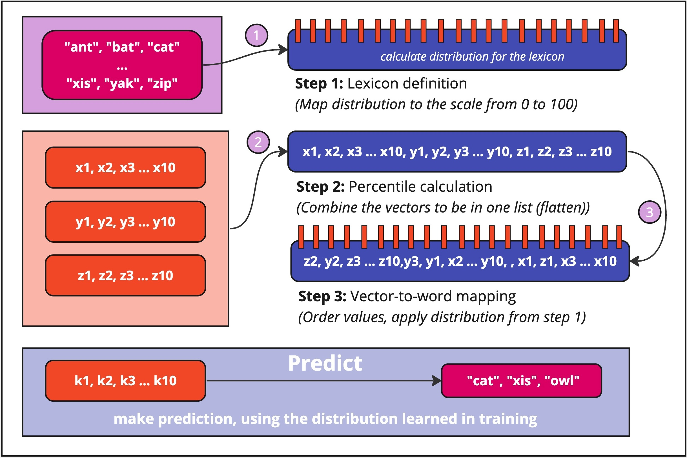

<p align="center">
  
</p>

<p align="center">
  <i>Language of Vectors (LangVec) is a simple Python library designed for transforming numerical vector data into a language-like structure using a predefined set of words (lexicon).</i>
</p>

## Approach

`LangVec` package leverages the concept of percentile-based mapping to assign words from a lexicon to numerical values,
facilitating intuitive and human-readable representations of numerical data.

<p align="center">
  
  <i>Simplified schema of how LangVec works</i>
</p>

## Where to use LangVec

The main application is in semantic search and similarity-based systems, where understanding the proximity between
vectors is crucial.  
By transforming complex numerical vectors into a lexicon-based representation, `LangVec` facilitates an intuitive
understanding of these similarities for humans.

In fields like machine learning and natural language processing, `LangVec` can assist in tasks such as clustering or
categorizing data, where a human-readable format is preferable for quick insights and decision-making.

## Installation

```bash
pip install langvec
```

## Usage

```python
import numpy as np

from langvec import LangVec

# Initialize LangVec
lv = LangVec()

dimensions = 10

# Generate some random data
v_1 = np.random.uniform(0, 1, dimensions)
v_2 = np.random.uniform(0, 1, dimensions)

# Save current model
lv.save("model.lv")

# Fit to this data (getting know to distribution)
lv.fit([v_1, v_2])

# Example vector for prediction
input_vector = np.random.uniform(0, 1, dimensions)

# Make prediction on unseen vector embedding
print(lv.predict(input_vector))
```

### Save and load model

LangVec allows you to save and load percentiles as model artifacts. This is useful for preserving the learned
distribution without needing to retrain the model. You can use the following methods:

#### Save model

```python
from langvec import LangVec

# Initialize LangVec
lv = LangVec()

# Save the model to file
lv.save("model.lv")
```

#### Load model

```python
from langvec import LangVec

# Initialize LangVec
lv = LangVec()

# Load the model from file
lv.load("model.lv")
```